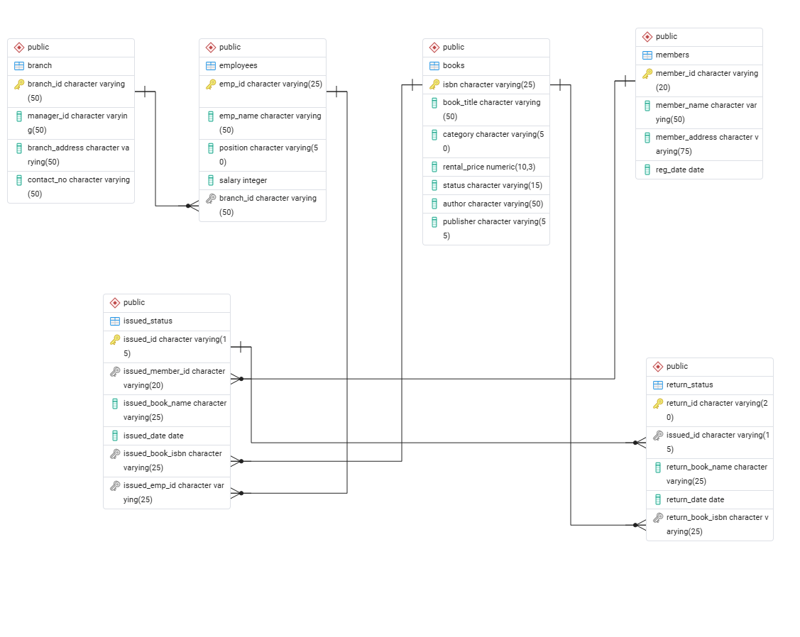

# Library Management System Analysis using SQL

## Summary

Developed a Library Management System Analysis project using PostgreSQL to design and analyze a relational database for managing books, members, employees, branches, issued records, and returned records. 
The project involved database creation, relationship mapping, CRUD operations, CTAS tables, stored procedures, and analytical SQL queries to evaluate library operations and generate meaningful business 
insights. Using SQL queries, I analyzed book availability, issued and returned books, branch performance, active members, overdue books, damaged returns, and employee activity. The project demonstrates 
practical skills in database design, joins, aggregation, CTEs, stored procedures, foreign keys, and business-focused SQL analysis using structured library data.

<p align="center">
  
</p>

## Project Objectives

1. Design and build a relational library database to manage books, members, branches, employees, issue transactions, and return transactions.
2. Establish relationships between tables using primary keys and foreign keys to maintain data integrity.​
3. Perform CRUD operations to manage library records such as books, members, and issue activity.​
4. Use CTAS queries to create summary tables for reporting and analysis.
5. Analyze book circulation, overdue records, active members, branch performance, and employee productivity.
6. Implement stored procedures to automate book issuing and return handling while updating book availability status.
7. Generate operational reports that support better decision-making for library management.

## Project Structure

<p align="center">
  
</p>

- Created a library database structure with six main tables: branch, employees, books, members, issuedstatus, and returnstatus.
- Defined primary keys for each table and foreign key relationships linking issued records to members, books, and employees, returns to issued records and books, and employees to branches.
- Updated selected column definitions such as booktitle, status, and issuedbookname to support longer text values.
- The database design is supported by an ERD showing relationships across all major entities in the system.

```sql
-- Library Analysis P2

-- Creating Tables

DROP TABLE IF EXISTS branch;
CREATE TABLE branch(
					branch_id VARCHAR(50) PRIMARY KEY,	
					manager_id VARCHAR(50),
					branch_address VARCHAR(50),
					contact_no VARCHAR(50)
);

DROP TABLE IF EXISTS employees;
CREATE TABLE employees(
			emp_id VARCHAR(25) PRIMARY KEY,	
			emp_name VARCHAR(50),
			position VARCHAR(50),
			salary INT,
			branch_id VARCHAR(50) 
);

DROP TABLE IF EXISTS books;
CREATE TABLE books (
			isbn VARCHAR(25) PRIMARY KEY,
			book_title VARCHAR(50),
			category VARCHAR(50),
			rental_price DECIMAL(10,3),
			status VARCHAR(15),
			author VARCHAR(50),
			publisher VARCHAR(55)

);
ALTER TABLE books
ALTER COLUMN status TYPE VARCHAR(50);

ALTER TABLE books
ALTER COLUMN book_title TYPE VARCHAR(100);

DROP TABLE IF EXISTS members;
CREATE TABLE members(
			 member_id VARCHAR(20) PRIMARY KEY,
			 member_name VARCHAR(50),
			 member_address VARCHAR(75),
			 reg_date DATE

);

DROP TABLE IF EXISTS issued_status;
CREATE TABLE issued_status(
				issued_id VARCHAR(15) PRIMARY KEY,
				issued_member_id VARCHAR(20), -- FK
				issued_book_name VARCHAR(25),
				issued_date DATE,
				issued_book_isbn VARCHAR(25), -- FK
				issued_emp_id VARCHAR(25) -- FK

);

ALTER TABLE issued_status
ALTER COLUMN issued_book_name TYPE VARCHAR(100);

DROP TABLE IF EXISTS return_status;
CREATE TABLE return_status(
			return_id VARCHAR(20) PRIMARY KEY,
			issued_id VARCHAR(15), -- FK
			return_book_name VARCHAR(25),
			return_date DATE,
			return_book_isbn VARCHAR(25) -- FK

);


-- Adding FK to build relationship
-- FOR issued_status table
ALTER TABLE issued_status
ADD CONSTRAINT fk_members
FOREIGN KEY (issued_member_id)
REFERENCES members(member_id);

ALTER TABLE issued_status
ADD CONSTRAINT fk_issued_books
FOREIGN KEY (issued_book_isbn)
REFERENCES books(isbn);

ALTER TABLE issued_status
ADD CONSTRAINT fk_emp
FOREIGN KEY (issued_emp_id)
REFERENCES employees(emp_id);


-- For return_status table
ALTER TABLE return_status
ADD CONSTRAINT fk_issued
FOREIGN KEY (issued_id)
REFERENCES issued_status(issued_id);

ALTER TABLE return_status
ADD CONSTRAINT fk_return_books
FOREIGN KEY (return_book_isbn)
REFERENCES books(isbn);

-- For employees table
ALTER TABLE employees
ADD CONSTRAINT fk_branch
FOREIGN KEY (branch_id)
REFERENCES branch(branch_id);
```
